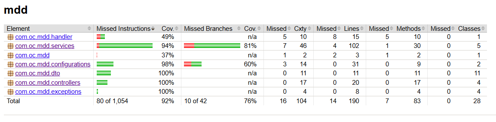
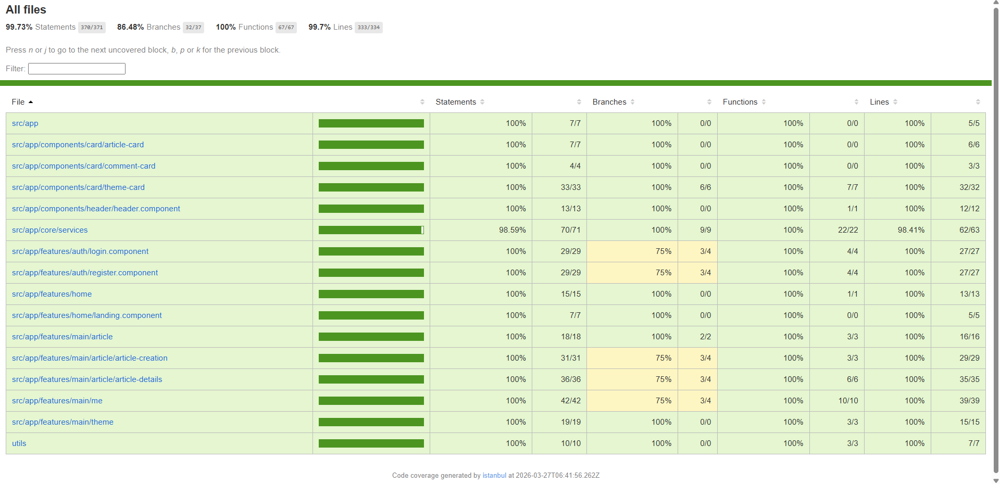
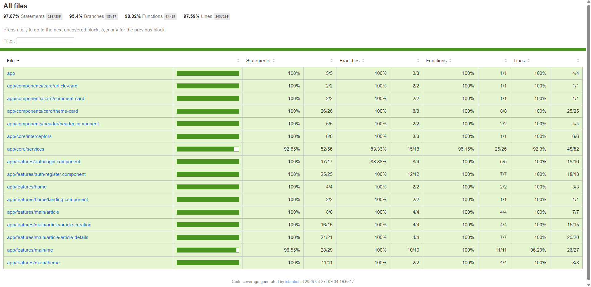

# MDD - Monde de Dév

MDD (Monde de Dév) is a specialized social network designed for developers. It allows professionals to share technical articles, subscribe to specific programming themes, and interact through comments. The platform aims to centralize technical knowledge sharing in a modern and intuitive environment.

## 🛠 Tech Stack

### Backend
* **Framework:** Spring Boot 4
* **Security:** Spring Security with JWT (JSON Web Tokens)
* **Database:** MySQL
* **Documentation:** OpenAPI / Swagger (available at `/swagger-ui.index.html`)

### Frontend
* **Framework:** Angular 21
* **UI Library:** Angular Material
* **Styling:** SCSS

---

## 🚀 Installation & Setup

### 1. Database Setup
1. Ensure you have **MySQL** installed and running.
2. Create a new database named `mdd_db`.
3. Execute the provided SQL schema script (`mdd_db.sql` file located in the backend resources) to initialize tables and default data.
4. Add DB access credentials and JWT secret to enviornment variables as `MDD_DB_USERNAME`, `MDD_DB_PASSWORD` and `JWT_SECRET_KEY`.
5. If you chose to use different database name, MySQL server port, DB access credentials or JWT secret, please remember to update the `application.properties` and `application-test.properties` files.

### 2. Backend Setup
1. Navigate to the `/backend` folder.
2. Run the application using Maven :

    `mvn spring-boot:run`

3. The server will start at : 

    `http://localhost:3001`

### 3. API Documentation

Once the backend server is started, the API documentation can be accessed at this link :
`http://localhost:3001/swagger-ui/index.html`

### 4. Frontend Setup

1. Navigate to `/frontend` folder.
2. Install dependencies : 

    `npm install`

3. Start the development server with one of the following commands:

    I. Basic dev server : `npm run start`

    II. Server for access with mobile (on the same networkd) : `npm run start:mobile`

    III. Server with instrumentalised code for cypress coverage reports generation : `npm run start:coverage` 

4. The server will be running at port `:4200`

### 5. Testing and Code Coverage

#### 5.1. Backend tests

1. To run unit tests : `mvn test`
2. To run unit and integration tests and generate coverage report : `mvn verify`
3. Coverage report can be found here : `\backend\target\site\jacoco\index.html`

#### 5.2. Frontend tests

1. To run unit and integration tests and generate Jest coverage report : `npm run test:coverage`
2. Coverage report can be found here : `\frontend\coverage\lcov-report\index.html`

3. To run e2e tests and generate coverage report, make sure to start the server with instrumentation then : `npm run cypress:run`
4. Coverage report can be found here : `\frontend\coverage\nyc\index.html`

